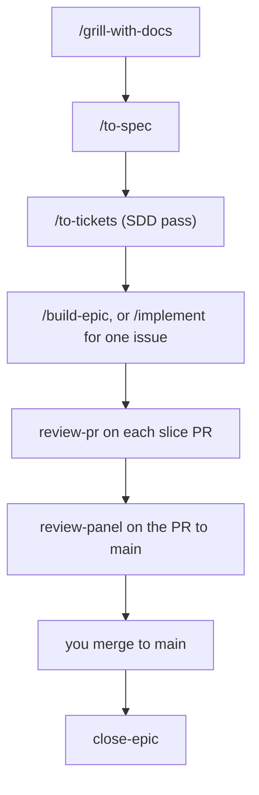

# skills-plus-plus

A fork of [Matt Pocock's skills](https://github.com/mattpocock/skills) that adds a spec-driven delivery pipeline on top of them. Matt's skills stay the spine (grill, spec, tickets, TDD, code review); this fork owns them too, so its additions live inside the same skills instead of calling across a plugin boundary.

The sections under [Why These Skills Exist](#why-these-skills-exist) are Matt's, in his voice, and carried over unchanged.

## Installation

Two ways in. **The [Claude Code plugin](https://code.claude.com/docs/en/plugins)** installs the whole set as a managed, read-only bundle. **[skills.sh](https://skills.sh/syn54x/skills-plus-plus)** copies editable skill files into your project. Pick one: installing both leaves you with every skill twice. If you already have `mattpocock-skills` installed, remove it first, since this set includes every skill it ships.

### 1. Get the skills

<details>
<summary><strong>Claude Code</strong></summary>

```bash
claude plugins marketplace add syn54x/skills-plus-plus
claude plugins install skills-plus-plus@syn54x
```

Or, from inside a session:

```
/plugin marketplace add syn54x/skills-plus-plus
/plugin install skills-plus-plus@syn54x
```

</details>

<details>
<summary><strong>Codex, and other agents</strong></summary>

```bash
npx skills@latest add syn54x/skills-plus-plus
```

Pick the skills you want, and which coding agents to install them on. **The installer lets you choose which skills to take, so make sure `setup-syn54x-skills` is one of them.**

</details>

### 2. Run `/setup-syn54x-skills`

In your agent, run it once per repo. It will:

- Ask you which issue tracker you want to use (GitHub, Linear, or local files)
- Ask you what labels you apply to tickets when you triage them (`/triage` uses labels)
- Ask you where you want to save any docs we create
- On GitHub, offer to switch on the SDD pipeline: labels, the routing block, and optional cloud workflows

### 3. Bam - you're ready to go.

## The SDD flow

On a GitHub repo, `/setup-syn54x-skills` can switch on a spec-driven delivery flow: the spec is an **epic** issue, the plan is its **sub-issues**, and the build runs in parallel waves of isolated workers, with a gated review on every PR.



1. `/grill-with-docs` irons out the idea, feature or bug.
2. `/to-spec` publishes the result as an epic issue.
3. `/to-tickets <epic#>` cuts tracer-bullet sub-issues. On this flow it also gives each one Files owned, Interfaces, Test scenarios and a Verify block, sizes it, links it natively (`--parent`, `--blocked-by`, in another repo when the code lives there), and pins one plan comment on the epic.
4. `/build-epic <epic#>` builds the epic in waves; `/implement #N` builds one issue. Each worker claims its issue, branches, writes failing tests first, runs Verify, and opens a PR with `Closes #N`. Workers never merge.
5. `review-pr` gates each slice PR into the integration branch: a fresh reviewer, Verify re-run, separate spec and quality verdicts, one fix round, then `ready-for-human`.
6. `review-panel` gates the PR to `main`, once per epic. You merge it.
7. `close-epic` checks every sub-issue is closed and the PR to `main` merged, posts the summary and the retro, and closes the epic.

Steps 5 to 7 are model-invoked: `/build-epic` reaches them, and you rarely type them.

A ticket is ready when it is open, has no open blockers, is unassigned, and carries `ready-for-agent`. Claiming is assigning yourself. Progress is one comment per issue under `<!-- sdd-progress -->`, rewritten in place. A multi-repo epic gets an integration branch, worktrees and PRs in each repo; tickets are identified by URL, and a cross-repo blocker has to be merged and available before its consumer is ready.

### Size ladder

`to-tickets` sets the size. The size picks the runtime. `implement-issue` is the worker in every row.

| Size | Ticket shape | Trigger | Runs where | Reviewer |
| --- | --- | --- | --- | --- |
| S | one context window, at most 3 files | label `ready-for-agent` | cloud: `claude-code-action` (`sdd-implement.yml`) | `sdd-review.yml` on the PR |
| M | needs its plan sections; 1 or 2 workers | `/build-epic` or `/implement` | local worker in its own worktree | fresh reviewer subagent |
| L | cross-cutting, or 3 or more sub-issues | `/build-epic` | local waves, 3 to 5 workers, one worktree each | reviewer per slice PR; `review-panel` on the PR to `main` |
| XL | 8 or more independent sub-issues | `/build-epic --workflow` | dynamic workflow (Claude Code, on opt-in) | scripted verify, then merge order; `review-panel` on the PR to `main` |

The concrete dispatch call per harness is in [`skills/engineering/build-epic/HARNESS-DISPATCH.md`](./skills/engineering/build-epic/HARNESS-DISPATCH.md).

## Why the SDD flow lives in GitHub Issues

The suites we looked at keep the plan in markdown: Superpowers, Compound Engineering, GSD, CCPM, PRPs, Spec Kit, BMAD, OpenSpec, cc-sdd, and a dozen smaller ones. The files live under `docs/plans/`, `.kiro/`, `openspec/`, or a similar directory.

- Reviewers read issues and PRs. A plan outside the tracker drifts from what shipped as soon as the first PR merges, and the people who have to approve the work never see it.
- Two installed suites fight over the plan, the `CLAUDE.md` block, and which `/plan` command wins. Each one also preloads several thousand tokens into every session.
- Each suite ships a runner for its own file format, so a different tool, a cloud runner, or another person cannot pick the plan up.

From 2025 through 2026, GitHub shipped sub-issues and issue types (April 2025), native blocked-by and blocking links (August 2025), issue fields on organization repos (July 2026), and `gh` 2.94 flags for them (`--parent`, `--blocked-by`, `--type`) with JSON output. An agent can read that plan with `gh`, without a separate extension.

The flow started as a separate pack layered on top of Matt's skills. That broke in use: his entry points are user-invoked, so no skill of ours could call `/to-tickets`, and a worker could not start a build skill on its own. This fork owns both halves, so the SDD pass lives inside `to-tickets` and every skill a worker or reviewer needs is model-invoked ([ADR 0003](./.agents/adr/0003-fork-superset-of-mattpocock-skills.md), [ADR 0004](./.agents/adr/0004-sdd-pipeline-invocation-graph.md)). `/to-spec` writes the epic. `/to-tickets` cuts tracer-bullet sub-issues and their blocking edges.

What was worth stealing from the other suites is now a section on the ticket, written as `gh` and prose, so it runs the same under Claude Code, Codex, Cursor, or a shell:

- Compound Engineering: file ownership and a verification contract
- Superpowers: the interfaces list, a no-placeholder rule, a fresh implementer and a fresh reviewer per task
- CCPM: comments that update in place under a marker
- gh-aw: a closer that walks sub-issues

Review effort follows the diff. A slice PR into the integration branch gets one fresh reviewer and two verdicts, spec and quality. A persona panel on every slice would cost nine times as much and produce noise. The PR to `main` is large, final, and spans the slices, so it gets `review-panel`. That panel uses Compound Engineering's persona selection and adversarial reviewer, Anthropic's confidence gate and history pass, Superpowers' calibration, and mattpocock's standards axis. It reads the ticket contracts and the repo's ADRs, and it uses the pipeline's severity vocabulary.

Readiness is computed from the tracker: open, no open blockers, unassigned, and labelled `ready-for-agent`. You claim a ticket by assigning yourself. The skills do not store readiness in a status field, because an agent-written status goes stale.

Workers run in waves of 3 to 5, each in its own worktree. The Agent Teams flag stays unset. Teammates get no worktree of their own, the task tools sit behind an experimental flag, and a team costs several times the tokens of a wave. Suites that tried teams went back to `Agent(isolation: "worktree")`, or they kept teams for discussion only.

Where the Claude Code plugin is installed, hooks enforce the stop rules. A worker on an `sdd/*` branch cannot stop without a recorded Verify run. A worktree with unpushed work cannot be removed. With only `npx skills add`, those rules are in the skill text.

None of these is a dependency:

- CCPM is unmaintained, and its docs use the wrong `gh-sub-issue` syntax.
- The original GSD is archived, after a token rug-pull.
- Spec Kit's `taskstoissues` exports one way and does not create parent links.
- Agent OS removed execution.
- oh-my-claudecode is built around Agent Teams and tmux.
- The full Superpowers, Compound Engineering, and ECC bundles, installed next to Matt's skills, collide on the planner and preload 3k to 22k tokens.

### Retros and skill feedback

`close-epic` posts a retro on the epic under `<!-- sdd-retro -->`. The counts come from label events, marker comments, and PR reviews: tickets by size, escalations, edges added mid-build, fix rounds, Verify-block corrections, panel findings, how many findings were dropped, and claim-to-PR time. The retro names which workflow step was weak. It stays in the user's repo.

Learnings are tagged `[repo]`, `[reusable]`, or `[skill]`. A `[skill]` learning is one the retro counts support.

With consent, a `[skill]` learning can become a `skill-feedback` issue on `syn54x/skills-plus-plus`. Setup asks, and the default is off, recorded as `Upstream feedback: on` or `off` in the routing block.

An issue may contain the skill, the step, a category from a closed set, counts, the harness version, and one sentence the user types. It may not contain repo or org names, URLs, ticket titles, paths, code, commit messages, or error text.

- Each issue is shown and approved on its own, filed under the user's GitHub account, and the issue is public. `--dry-run` prints the bodies.
- A non-interactive run never files. Drafts go on the epic for the user to file or discard. A private repo always asks for confirmation.
- A URL, repo name, existing path, code, title, or error text in the body stops the filing. The guard does not rewrite the body.

Rules and template: [`skills/engineering/close-epic/SKILL-FEEDBACK.md`](./skills/engineering/close-epic/SKILL-FEEDBACK.md).

Planned next: regression evals built from fixed defects, and a scheduled routine that clusters feedback into PRs on this repo.

## Why These Skills Exist

I built these skills as a way to fix common failure modes I see with Claude Code, Codex, and other coding agents.

### #1: The Agent Didn't Do What I Want

> "No-one knows exactly what they want"
>
> David Thomas & Andrew Hunt, [The Pragmatic Programmer](https://www.amazon.co.uk/Pragmatic-Programmer-Anniversary-Journey-Mastery/dp/B0833F1T3V)

**The Problem**. The most common failure mode in software development is misalignment. You think the dev knows what you want. Then you see what they've built - and you realize it didn't understand you at all.

This is just the same in the AI age. There is a communication gap between you and the agent. The fix for this is a **grilling session** - getting the agent to ask you detailed questions about what you're building.

**The Fix** is to use:

- [`/grill-me`](./skills/productivity/grill-me/SKILL.md) - for non-code uses
- [`/grill-with-docs`](./skills/engineering/grill-with-docs/SKILL.md) - same as [`/grill-me`](./skills/productivity/grill-me/SKILL.md), but adds more goodies (see below)

These are my most popular skills. They help you align with the agent before you get started, and think deeply about the change you're making. Use them _every_ time you want to make a change.

### #2: The Agent Is Way Too Verbose

> With a ubiquitous language, conversations among developers and expressions of the code are all derived from the same domain model.
>
> Eric Evans, [Domain-Driven-Design](https://www.amazon.co.uk/Domain-Driven-Design-Tackling-Complexity-Software/dp/0321125215)

**The Problem**: At the start of a project, devs and the people they're building the software for (the domain experts) are usually speaking different languages.

I felt the same tension with my agents. Agents are usually dropped into a project and asked to figure out the jargon as they go. So they use 20 words where 1 will do.

**The Fix** for this is a shared language. It's a document that helps agents decode the jargon used in the project.

<details>
<summary>
Example
</summary>

Here's an example [`CONTEXT.md`](https://github.com/mattpocock/course-video-manager/blob/076a5a7a182db0fe1e62971dd7a68bcadf010f1c/CONTEXT.md), from my `course-video-manager` repo. Which one is easier to read?

- **BEFORE**: "There's a problem when a lesson inside a section of a course is made 'real' (i.e. given a spot in the file system)"
- **AFTER**: "There's a problem with the materialization cascade"

This concision pays off session after session.

</details>

This is built into [`/grill-with-docs`](./skills/engineering/grill-with-docs/SKILL.md). It's a grilling session, but that helps you build a shared language with the AI, and document hard-to-explain decisions in ADR's.

It's hard to explain how powerful this is. It might be the single coolest technique in this repo. Try it, and see.

> [!TIP]
> A shared language has many other benefits than reducing verbosity:
>
> - **Variables, functions and files are named consistently**, using the shared language
> - As a result, the **codebase is easier to navigate** for the agent
> - The agent also **spends fewer tokens on thinking**, because it has access to a more concise language

### #3: The Code Doesn't Work

> "Always take small, deliberate steps. The rate of feedback is your speed limit. Never take on a task that’s too big."
>
> David Thomas & Andrew Hunt, [The Pragmatic Programmer](https://www.amazon.co.uk/Pragmatic-Programmer-Anniversary-Journey-Mastery/dp/B0833F1T3V)

**The Problem**: Let's say that you and the agent are aligned on what to build. What happens when the agent _still_ produces crap?

It's time to look at your feedback loops. Without feedback on how the code it produces actually runs, the agent will be flying blind.

**The Fix**: You need the usual tranche of feedback loops: static types, browser access, and automated tests.

For automated tests, a red-green-refactor loop is critical. This is where the agent writes a failing test first, then fixes the test. This helps give the agent a consistent level of feedback that results in far better code.

I've built a **[`/tdd`](./skills/engineering/tdd/SKILL.md) skill** you can slot into any project. It encourages red-green-refactor and gives the agent plenty of guidance on what makes good and bad tests.

For debugging, I've also built a **[`/diagnosing-bugs`](./skills/engineering/diagnosing-bugs/SKILL.md)** skill that wraps best debugging practices into a disciplined loop, gated phase by phase.

### #4: We Built A Ball Of Mud

> "Invest in the design of the system _every day_."
>
> Kent Beck, [Extreme Programming Explained](https://www.amazon.co.uk/Extreme-Programming-Explained-Embrace-Change/dp/0321278658)

> "The best modules are deep. They allow a lot of functionality to be accessed through a simple interface."
>
> John Ousterhout, [A Philosophy Of Software Design](https://www.amazon.co.uk/Philosophy-Software-Design-2nd/dp/173210221X)

**The Problem**: Most apps built with agents are complex and hard to change. Because agents can radically speed up coding, they also accelerate software entropy. Codebases get more complex at an unprecedented rate.

**The Fix** for this is a radical new approach to AI-powered development: caring about the design of the code.

This is built in to every layer of these skills:

- [`/to-spec`](./skills/engineering/to-spec/SKILL.md) quizzes you about which modules you're touching before creating a spec

And crucially, [`/improve-codebase-architecture`](./skills/engineering/improve-codebase-architecture/SKILL.md) surveys a codebase for deepening opportunities and hands you the candidates. I recommend running it on your codebase once every few days. It is a survey, not a rescue: on a genuinely old codebase it will find real candidates, but it won't untangle the mud for you.

### Summary

Software engineering fundamentals matter more than ever. These skills are my best effort at condensing these fundamentals into repeatable practices, to help you ship the best apps of your career. Enjoy.

## Reference

These split on one axis: who can invoke them. **User-invoked** skills are reachable only when you type them (e.g. `/grill-me`); their job is to orchestrate. **Model-invoked** skills can be invoked by you _or_ reached for automatically by the agent when the task fits; they hold the reusable discipline. A user-invoked skill may invoke model-invoked skills, but never another user-invoked one.

### Engineering

Skills I use daily for code work.

**User-invoked**

- **[ask-syn54x](./skills/engineering/ask-syn54x/SKILL.md)**: Ask which skill or flow fits your situation. A router over the user-invoked skills in this repo.
- **[grill-with-docs](./skills/engineering/grill-with-docs/SKILL.md)**: Grilling session that also builds your project's domain model, sharpening terminology and updating `CONTEXT.md` and ADRs inline.
- **[triage](./skills/engineering/triage/SKILL.md)**: Move issues through a state machine of triage roles.
- **[improve-codebase-architecture](./skills/engineering/improve-codebase-architecture/SKILL.md)**: Scan a codebase for deepening opportunities, present them as a visual HTML report, then grill through whichever one you pick.
- **[setup-syn54x-skills](./skills/engineering/setup-syn54x-skills/SKILL.md)**: Configure this repo for the engineering skills (issue tracker, triage labels, domain doc layout, and on GitHub the SDD pipeline). Run once per repo before using the other engineering skills.
- **[to-spec](./skills/engineering/to-spec/SKILL.md)**: Turn the current conversation into a spec and publish it to the issue tracker. No interview, just synthesizes what you've already discussed.
- **[to-tickets](./skills/engineering/to-tickets/SKILL.md)**: Break any plan, spec, or conversation into a set of tracer-bullet tickets, each declaring its blocking edges, written as text in a local file, or as native blocking links on a real tracker.
- **[implement](./skills/engineering/implement/SKILL.md)**: Build the work described by a spec or set of tickets, driving `/tdd` at pre-agreed seams and closing out with `/code-review` before committing.
- **[build-epic](./skills/engineering/build-epic/SKILL.md)**: Build an SDD epic with parallel workers in isolated worktrees, a fresh reviewer on every PR, merges in dependency order, and a panel review of the PR to `main`.
- **[wayfinder](./skills/engineering/wayfinder/SKILL.md)**: Plan a huge chunk of work, more than one agent session can hold, as a shared map of decision tickets on the issue tracker, and resolve them one at a time until the way to the destination is clear.

**Model-invoked**

- **[prototype](./skills/engineering/prototype/SKILL.md)**: Build a throwaway prototype to answer a design question, either a single shareable HTML file for state/logic questions, or several radically different UI variations toggleable from one route.
- **[diagnosing-bugs](./skills/engineering/diagnosing-bugs/SKILL.md)**: Disciplined diagnosis loop for hard bugs and performance regressions: build a feedback loop that goes red on this bug → minimise → hypothesise → instrument → fix → regression-test.
- **[research](./skills/engineering/research/SKILL.md)**: Investigate a question against high-trust primary sources and capture the findings as a cited Markdown file in the repo, run as a background agent.
- **[tdd](./skills/engineering/tdd/SKILL.md)**: Test-driven development with a red-green-refactor loop. Builds features or fixes bugs one vertical slice at a time.
- **[domain-modeling](./skills/engineering/domain-modeling/SKILL.md)**: Actively build and sharpen a project's domain model: challenge terms against the glossary, stress-test with edge-case scenarios, and update `CONTEXT.md` and ADRs inline.
- **[codebase-design](./skills/engineering/codebase-design/SKILL.md)**: Shared discipline and vocabulary for designing deep modules: a lot of behaviour behind a small interface, placed at a clean seam, testable through that interface.
- **[code-review](./skills/engineering/code-review/SKILL.md)**: Two-axis review of the diff since a fixed point: **Standards** (does it follow the repo's coding standards, plus a Fowler smell baseline?) and **Spec** (does it faithfully implement the originating issue/spec?), run as parallel sub-agents so neither pollutes the other.
- **[resolving-merge-conflicts](./skills/engineering/resolving-merge-conflicts/SKILL.md)**: Work through an in-progress git merge or rebase conflict hunk by hunk, resolving by intent traced to each side's primary source, then finish the operation (never `--abort`).
- **[wizard](./skills/engineering/wizard/SKILL.md)**: Generate an interactive bash wizard that walks a human through steps only they can perform: provisioning infrastructure, setting up credentials or CI secrets, walking an unfamiliar third-party dashboard, or running a one-off migration or cutover.
- **[implement-issue](./skills/engineering/implement-issue/SKILL.md)**: Build one SDD sub-issue to a PR: claim, branch, TDD from its Test scenarios, run its Verify block, open a PR that closes it.
- **[review-pr](./skills/engineering/review-pr/SKILL.md)**: Gate a slice PR with a fresh reviewer: re-run Verify, then separate Spec and Quality verdicts, one fix round, then `ready-for-human`.
- **[review-panel](./skills/engineering/review-panel/SKILL.md)**: Panel review for the PR to `main`: review-pr's spec and coherence verdicts plus parallel reviewer personas, deduped into one report.
- **[close-epic](./skills/engineering/close-epic/SKILL.md)**: Close an SDD epic after its PR to `main` merges: summary, retro from GitHub state, tagged learnings, and consented skill feedback.
- **[sync-progress](./skills/engineering/sync-progress/SKILL.md)**: One marker comment per issue, rewritten in place, plus claim and unclaim by assignment. The bookkeeping under every SDD skill.
- **[scaffold-python-project](./skills/engineering/scaffold-python-project/SKILL.md)**: Scaffold a new Python repo on one opinionated stack (uv, prek, ruff, ty, pytest, zensical, pydantic, structlog, ferro-orm, GitHub Actions), with optional CLI, API, database, Logfire, docs and PyPI flags.
- **[scaffold-frontend-project](./skills/engineering/scaffold-frontend-project/SKILL.md)**: Scaffold a new React SPA on one opinionated stack (Vite, TypeScript, pnpm, Biome, TanStack Router and Query, Tailwind, shadcn/ui, vitest, GitHub Actions), with optional Playwright and OpenAPI client.
- **[prepare-release-notes](./skills/engineering/prepare-release-notes/SKILL.md)**: Draft bloggy GitHub Release highlights from the commits and PRs since the last tag, and print the release command without running it.

### Productivity

General workflow tools, not code-specific.

**User-invoked**

- **[adhd](./skills/productivity/adhd/SKILL.md)**: The shortest useful answer: the point first, at most three bullets, then stop.
- **[eli5](./skills/productivity/eli5/SKILL.md)**: A plain-language explanation with one everyday analogy.
- **[grill-me](./skills/productivity/grill-me/SKILL.md)**: Get relentlessly interviewed about a plan or design until every branch of the design tree is resolved.
- **[handoff](./skills/productivity/handoff/SKILL.md)**: Compact the current conversation into a handoff document so another agent can continue the work.
- **[teach](./skills/productivity/teach/SKILL.md)**: Teach the user a new skill or concept over multiple sessions, using the current directory as a stateful teaching workspace.
- **[to-questionnaire](./skills/productivity/to-questionnaire/SKILL.md)**: Turn a decision you can't answer alone into a Markdown questionnaire for the one person who can, filled in async, or together over a meeting. It grills you about the send (who it's for, what you need back), not the subject.
- **[wait-what](./skills/productivity/wait-what/SKILL.md)**: Fire this the moment a message doesn't land. The agent re-pitches it with the context you're missing, in plain English, using your `CONTEXT.md` vocabulary.

**Model-invoked**

- **[grilling](./skills/productivity/grilling/SKILL.md)**: Interview the user relentlessly about a plan, decision, or idea until every branch of the design tree is resolved. The reusable interview primitive behind `grill-me`, `grill-with-docs`, `triage`, `wayfinder` and `improve-codebase-architecture`.
- **[writing-for-agents](./skills/productivity/writing-for-agents/SKILL.md)**: Writing documents for agents: skills, AGENTS.md/CLAUDE.md, and any doc an agent reaches by a pointer.
