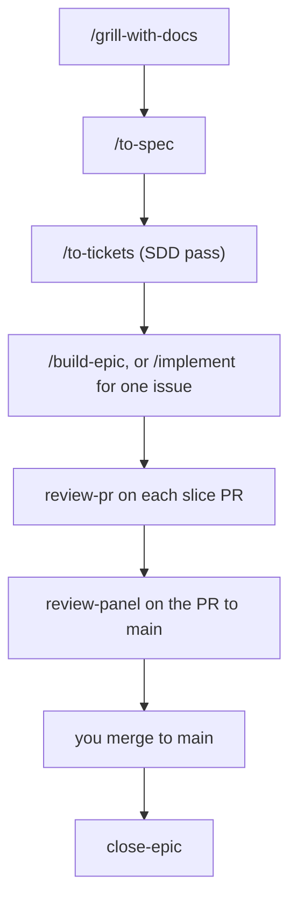

# skills-plus-plus

A fork of [Matt Pocock's skills](https://github.com/mattpocock/skills) that adds a spec-driven delivery pipeline on top of them. The upstream skills stay the spine (grill, spec, tickets, TDD, code review); this fork owns them too, so its additions live inside the same skills instead of calling across a plugin boundary. The source, the changelog and the issue tracker live at [syn54x/skills-plus-plus](https://github.com/syn54x/skills-plus-plus).

Every page on this site is about one skill: what it does, when to reach for it, the questions people ask about it, and how to tell it is working. The pages are not the skills; the skills are the `SKILL.md` files the agent reads.

## Install

Two ways in. **The [Claude Code plugin](https://code.claude.com/docs/en/plugins)** installs the whole set as a managed, read-only bundle. **[skills.sh](https://skills.sh/syn54x/skills-plus-plus)** copies editable skill files into your project. Pick one: installing both leaves you with every skill twice. If you already have `mattpocock-skills` installed, remove it first, since this set includes every skill it ships.

### Claude Code

```bash
claude plugins marketplace add syn54x/skills-plus-plus
claude plugins install skills-plus-plus@syn54x
```

Or, from inside a session:

```
/plugin marketplace add syn54x/skills-plus-plus
/plugin install skills-plus-plus@syn54x
```

### Codex, and other agents

```bash
npx skills@latest add syn54x/skills-plus-plus
```

Pick the skills you want, and which coding agents to install them on. **The installer lets you choose which skills to take: make sure `setup-syn54x-skills` is one of them.**

### Then, once per repo

Run [`/setup-syn54x-skills`](engineering/setup-syn54x-skills.md) in your agent. It asks which issue tracker you use, which labels you triage with, where docs should go, and on GitHub whether to switch on the SDD pipeline.

## Where to start

Not sure which skill fits? [ask-syn54x](engineering/ask-syn54x.md) is the router: describe your situation and it names the skill, or the sequence of skills, and where your own decisions sit in it.

The spec-driven delivery (SDD) flow is the backbone of the engineering set. The spec is an epic issue, the plan is its sub-issues, and the build runs in parallel waves of isolated workers with a gated review on every PR:



Read it as [grill-with-docs](engineering/grill-with-docs.md), then [to-spec](engineering/to-spec.md), then [to-tickets](engineering/to-tickets.md), then [build-epic](engineering/build-epic.md) (or [implement](engineering/implement.md) for one issue), with [review-pr](engineering/review-pr.md), [review-panel](engineering/review-panel.md) and [close-epic](engineering/close-epic.md) fired by the agent along the way.

## The skills

They split on one axis: who can invoke them. **User-invoked** skills are reachable only when you type them; their job is to orchestrate. **Model-invoked** skills the agent reaches for on its own when a task fits, and you can type them too.

### Engineering

Skills for daily code work.

**User-invoked**

- **[ask-syn54x](engineering/ask-syn54x.md)**: Ask which skill or flow fits your situation. A router over the user-invoked skills in this repo.
- **[grill-with-docs](engineering/grill-with-docs.md)**: Grilling session that also builds your project's domain model, sharpening terminology and updating `CONTEXT.md` and ADRs inline.
- **[triage](engineering/triage.md)**: Move issues through a state machine of triage roles.
- **[improve-codebase-architecture](engineering/improve-codebase-architecture.md)**: Scan a codebase for deepening opportunities, present them as a visual HTML report, then grill through whichever one you pick.
- **[improve-pr-architecture](engineering/improve-pr-architecture.md)**: Read one pull request for deepening opportunities it introduced or brushed against, present them as a markdown report you can post as a PR comment, then grill through whichever one you pick.
- **[setup-syn54x-skills](engineering/setup-syn54x-skills.md)**: Configure this repo for the engineering skills (issue tracker, triage labels, domain doc layout, and on GitHub the SDD pipeline). Run once per repo before using the other engineering skills.
- **[to-spec](engineering/to-spec.md)**: Turn the current conversation into a spec and publish it to the issue tracker. No interview, just synthesizes what you've already discussed.
- **[to-tickets](engineering/to-tickets.md)**: Break any plan, spec, or conversation into a set of tracer-bullet tickets, each declaring its blocking edges, written as text in a local file, or as native blocking links on a real tracker.
- **[implement](engineering/implement.md)**: Build the work described by a spec or set of tickets, driving `/tdd` at pre-agreed seams and closing out with `/code-review` before committing.
- **[build-epic](engineering/build-epic.md)**: Build an SDD epic with parallel workers in isolated worktrees, a fresh reviewer on every PR, merges in dependency order, and a panel review of the PR to `main`.
- **[wayfinder](engineering/wayfinder.md)**: Plan a huge chunk of work, more than one agent session can hold, as a shared map of decision tickets on the issue tracker, and resolve them one at a time until the way to the destination is clear.

**Model-invoked**

- **[prototype](engineering/prototype.md)**: Build a throwaway prototype to answer a design question, either a single shareable HTML file for state/logic questions, or several radically different UI variations toggleable from one route.
- **[diagnosing-bugs](engineering/diagnosing-bugs.md)**: Disciplined diagnosis loop for hard bugs and performance regressions: build a feedback loop that goes red on this bug → minimise → hypothesise → instrument → fix → regression-test.
- **[research](engineering/research.md)**: Investigate a question against high-trust primary sources and capture the findings as a cited Markdown file in the repo, run as a background agent.
- **[tdd](engineering/tdd.md)**: Test-driven development with a red-green-refactor loop. Builds features or fixes bugs one vertical slice at a time.
- **[domain-modeling](engineering/domain-modeling.md)**: Actively build and sharpen a project's domain model: challenge terms against the glossary, stress-test with edge-case scenarios, and update `CONTEXT.md` and ADRs inline.
- **[codebase-design](engineering/codebase-design.md)**: Shared discipline and vocabulary for designing deep modules: a lot of behaviour behind a small interface, placed at a clean seam, testable through that interface.
- **[code-review](engineering/code-review.md)**: Two-axis review of the diff since a fixed point: **Standards** (does it follow the repo's coding standards, plus a Fowler smell baseline?) and **Spec** (does it faithfully implement the originating issue/spec?), run as parallel sub-agents so neither pollutes the other.
- **[resolving-merge-conflicts](engineering/resolving-merge-conflicts.md)**: Work through an in-progress git merge or rebase conflict hunk by hunk, resolving by intent traced to each side's primary source, then finish the operation (never `--abort`).
- **[wizard](engineering/wizard.md)**: Generate an interactive bash wizard that walks a human through steps only they can perform: provisioning infrastructure, setting up credentials or CI secrets, walking an unfamiliar third-party dashboard, or running a one-off migration or cutover.
- **[implement-issue](engineering/implement-issue.md)**: Build one SDD sub-issue to a PR: claim, branch, TDD from its Test scenarios, run its Verify block, open a PR that closes it.
- **[review-pr](engineering/review-pr.md)**: Gate a slice PR with a fresh reviewer: re-run Verify, then separate Spec and Quality verdicts, one fix round, then `ready-for-human`.
- **[review-panel](engineering/review-panel.md)**: Panel review for the PR to `main`: review-pr's spec and coherence verdicts plus parallel reviewer personas, deduped into one report.
- **[close-epic](engineering/close-epic.md)**: Close an SDD epic after its PR to `main` merges: summary, retro from GitHub state, tagged learnings, and consented skill feedback.
- **[sync-progress](engineering/sync-progress.md)**: One marker comment per issue, rewritten in place, plus claim and unclaim by assignment. The bookkeeping under every SDD skill.
- **[scaffold-python-project](engineering/scaffold-python-project.md)**: Scaffold a new Python repo on one opinionated stack (uv, prek, ruff, ty, pytest, zensical, pydantic, structlog, ferro-orm, GitHub Actions), with optional CLI, API, database, Logfire, docs and PyPI flags.
- **[scaffold-frontend-project](engineering/scaffold-frontend-project.md)**: Scaffold a new React SPA on one opinionated stack (Vite, TypeScript, pnpm, Biome, TanStack Router and Query, Tailwind, shadcn/ui, vitest, GitHub Actions), with optional Playwright and OpenAPI client.
- **[prepare-release-notes](engineering/prepare-release-notes.md)**: Draft bloggy GitHub Release highlights from the commits and PRs since the last tag, and print the release command without running it.

### Productivity

General workflow tools, not code-specific.

**User-invoked**

- **[adhd](productivity/adhd.md)**: The shortest useful answer: the point first, at most three bullets, then stop.
- **[eli5](productivity/eli5.md)**: A plain-language explanation with one everyday analogy.
- **[grill-me](productivity/grill-me.md)**: Get relentlessly interviewed about a plan or design until every branch of the design tree is resolved.
- **[handoff](productivity/handoff.md)**: Compact the current conversation into a handoff document so another agent can continue the work.
- **[teach](productivity/teach.md)**: Teach the user a new skill or concept over multiple sessions, using the current directory as a stateful teaching workspace.
- **[to-questionnaire](productivity/to-questionnaire.md)**: Turn a decision you can't answer alone into a Markdown questionnaire for the one person who can, filled in async, or together over a meeting. It grills you about the send (who it's for, what you need back), not the subject.
- **[wait-what](productivity/wait-what.md)**: Fire this the moment a message doesn't land. The agent re-pitches it with the context you're missing, in plain English, using your `CONTEXT.md` vocabulary.

**Model-invoked**

- **[grilling](productivity/grilling.md)**: Interview the user relentlessly about a plan, decision, or idea until every branch of the design tree is resolved. The reusable interview primitive behind `grill-me`, `grill-with-docs`, `triage`, `wayfinder`, `improve-codebase-architecture` and `improve-pr-architecture`.
- **[writing-for-agents](productivity/writing-for-agents.md)**: Writing documents for agents: skills, AGENTS.md/CLAUDE.md, and any doc an agent reaches by a pointer.
